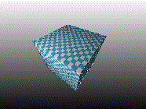
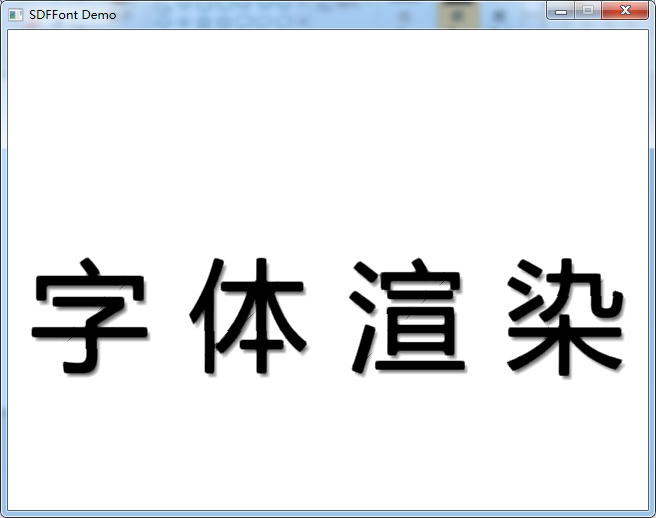
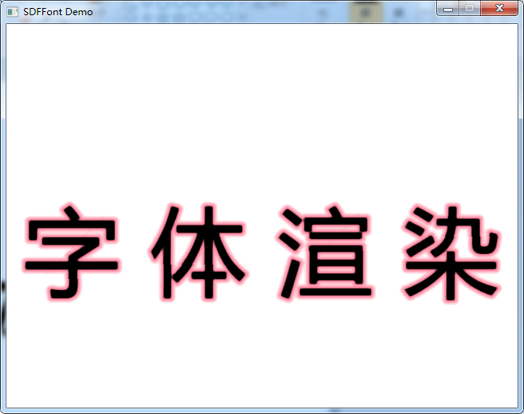

# ClosestGL

## 一个简陋的软件渲染工具库

### 已有的功能
- 基本数学库
- 并行执行策略
- CVV剪裁
- IndexBuffer生成器
- 透视除法缓存
- 图元列表读取器、图元Strip读取器、直接图元阅读器
- 固定变换器（用于顶点着色器）、重建变换器（用于几何着色器）、就地变换器
- 直线光栅器
- 像素着色器
- 渲染目标和混合器
- Texture2D
- 线程安全队列

### 光栅渲染管线

### 使用说明
直接使用本库是不需要任何依赖的。
如果需要执行其中的测试例子（ClosestGLTest项目），需要SDL2库。
把SDL2库解压到解决方案目录下，重命名为“SDL2”即可。

### API特殊说明
对于所有API中使用指针传递的地方，请注意，被传入指针的对象生命周期不得长于指针指向的对象。

### 例子
#### ExampleCube
该例子演示了如何从ClosestGL渲染一个带BlinPhong光照的立方体到SDLClasses窗口，
以及对该立方体应用运动模糊和法线贴图。

[例子代码](ExampleCube/main.cpp)

#### ExampleFontRendering
该例子演示了如何渲染SDF字体，并且添加软阴影和外发光。
[例子代码](ExampleFontRendering/main.cpp)

