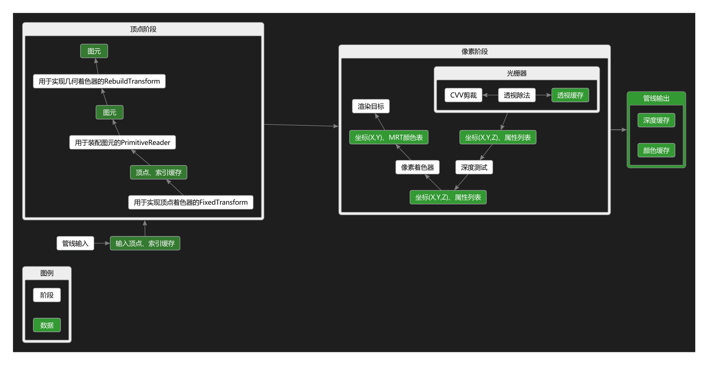

# ClosestGL

## 一个简陋的软件渲染工具库

### 已有的功能
1.基本数学库
2.并行执行策略
3.CVV剪裁
4.IndexBuffer生成器
5.透视除法缓存
6.图元列表读取器、图元Strip读取器、直接图元阅读器
7.固定变换器（用于顶点着色器）、重建变换器（用于几何着色器）、就地变换器
8.直线光栅器
9.像素着色器
10.渲染目标和混合器
11.Texture2D
12.线程安全队列

### 光栅渲染管线

### 光栅渲染管线效果

### 使用说明
直接使用本库是不需要任何依赖的。
如果需要执行其中的测试例子（ClosestGLTest项目），需要SDL2库。
把SDL2库解压到解决方案目录下，重命名为“SDL2”即可。

### API特殊说明
对于所有API中使用指针传递的地方，请注意，被传入指针的对象生命周期不得长于指针指向的对象。

### 例子
该例子演示了如何从ClosestGL渲染一个带BlinPhong光照的立方体到SDLClasses窗口。
[例子代码](ExampleCube/main.cpp)

